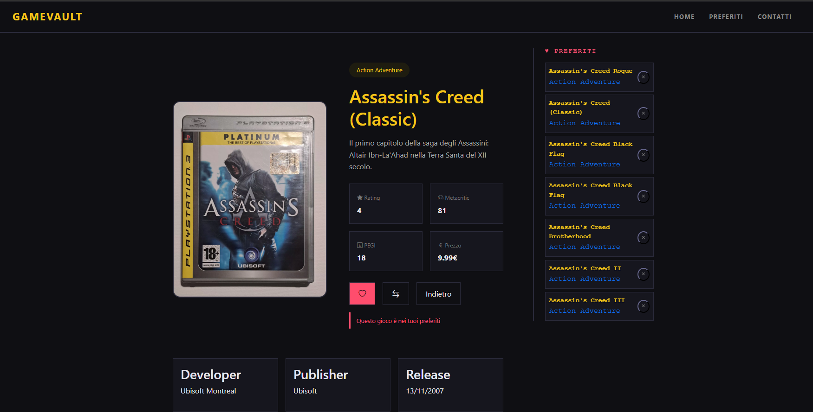
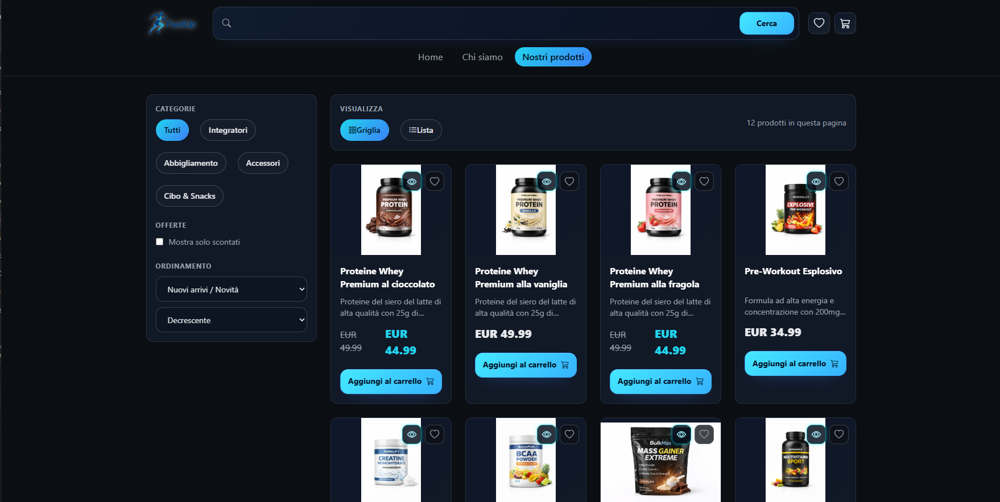
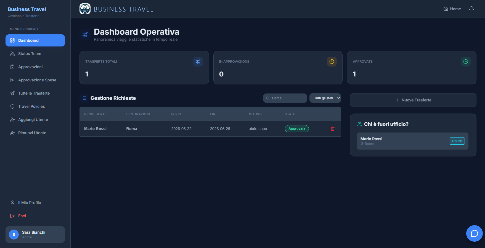

<div align="center">


<br/>


<br/><br/>

[](https://www.linkedin.com/in/jose-alexander-yepez-mejia-960b263b2/)
[](https://github.com/AlexanderYepez-code/AlexanderYepez-code)
[](mailto:j.yepezmejia02@gmail.com)
[](https://github.com/AlexanderYepez-code)

</div>

<br/>

## 🧑‍💻 Chi Sono

```javascript
const alexander = {
    posizione: "🇮🇹 Italia",
    ruolo: "Sviluppatore Front-End Junior",
    background: "3 Anni IT Help Desk → Developer",
    formazione: "Boolean Careers (2025)",
    focusAttuale: ["React", "TypeScript", "Node.js", "PHP", "Laravel"],
    passioni: ["Codice Pulito", "UI/UX Design", "Problem Solving"],
    obiettivo: "Ottenere il mio primo ruolo da Developer 🚀"
};
```

> 💡 Ex professionista IT Help Desk con 3 anni di esperienza, ora completamente dedicato allo sviluppo web.
> Formato presso **Boolean Careers** con specializzazione in **React**.

<br/>

## 🛠️ Tecnologie

<div align="center">

### Linguaggi & Framework


### Strumenti & Piattaforme


### 📚 Sto Imparando


</div>

<br/>

## 🚀 Progetti in Evidenza

<div align="center">

<!-- ═══════════════════ PROJECT 1 ═══════════════════ -->

### 🎮 GameVault — Videogame Comparator

> *Confronta i tuoi videogiochi preferiti side-by-side e salva la tua lista dei preferiti*



<br/>

📌 **Descrizione:** Applicazione web che permette di confrontare diversi videogiochi attraverso un **comparatore interattivo**. L'utente può selezionare i giochi, visualizzarne le caratteristiche affiancate e gestire una **lista di preferiti** personale. I dati dei preferiti vengono salvati nel **localStorage** per garantire la persistenza tra le sessioni.

<br/>


<br/>

**Funzionalità principali:**
- 🔍 Comparatore side-by-side di videogiochi
- ⭐ Lista dei preferiti con persistenza via LocalStorage
- 📱 Design responsive
- ⚡ Server Express per la gestione dei dati

<br/>

---

<!-- ═══════════════════ PROJECT 2 ═══════════════════ -->

### 🛒 FuelUp — E-commerce Fitness

> *E-commerce completo per prodotti fitness con gestione ordini e notifiche email*



<br/>

📌 **Descrizione:** Piattaforma e-commerce **full-stack** dedicata a prodotti per il fitness e il benessere. L'applicazione offre un'esperienza d'acquisto completa: navigazione prodotti, carrello, filtri avanzati e gestione ordini. Al completamento di un ordine, viene inviata una **notifica via email** di conferma. L'unica funzionalità esclusa è la modalità di pagamento reale, ma tutto il resto del flusso è completamente implementato, incluso il **database MySQL** per la persistenza dei dati.

<br/>


<br/>

**Funzionalità principali:**
- 🛍️ Catalogo prodotti con filtri e ricerca
- 🛒 Carrello interattivo con gestione quantità
- 📧 Notifica email alla conferma dell'ordine
- 🗄️ Database MySQL per prodotti, utenti e ordini
- 📱 Interfaccia responsive e moderna

<br/>

---

<!-- ═══════════════════ PROJECT 3 ═══════════════════ -->

### ✈️ BussiTravel — Gestionale Trasferte

> *Sistema gestionale completo per la gestione delle trasferte aziendali*



<br/>

📌 **Descrizione:** Applicazione web gestionale progettata per organizzare e monitorare le **trasferte aziendali**. Il sistema permette di creare, modificare e gestire trasferte, assegnare dipendenti, tracciare gli stati e gestire la documentazione associata. Un progetto full-stack completo con architettura moderna e containerizzazione Docker.

<br/>


<br/>

**Funzionalità principali:**
- 📋 CRUD completo per le trasferte
- 👥 Gestione dipendenti e assegnazioni
- 📊 Dashboard con panoramica trasferte
- 🐳 Containerizzazione con Docker e Docker Compose
- 🗄️ Database MySQL con relazioni strutturate
- 🔐 Gestione autenticazione e ruoli

<br/>

</div>

<br/>

<br/>

## 💼 Percorso Professionale

```
  2019  ─────  🎓 Diploma Perito Elettronico
                │
  2022  ─────  🖥️ IT Help Desk (3 anni di esperienza)
                │
  2025  ─────  📖 Boolean Careers — Specializzazione React
                │
  2025  ─────  ⚛️ Front-End Developer
                │
  NOW   ─────  🚀 In cerca della prima opportunità come Developer
```

<br/>

## 📊 Statistiche GitHub

<div align="center">


&nbsp;&nbsp;


<br/><br/>


<br/><br/>


</div>

<br/>

## 🎯 Obiettivi 2026

- ✅ Completare la specializzazione Front-End
- 🔥 Padroneggiare PHP e Laravel
- 🔥 Imparare Angular
- 🔥 Contribuire a progetti Open Source
- 🔥 Ottenere il primo ruolo come Developer

<br/>

## ⚡ Curiosità su di Me

```
🎮 Videogiocatore  🏋️ Fitness          🎧 Amante della Musica
📚 Appassionato Tech  ☕ Dipendente dal Caffè  🌍 Viaggiatore
```

<br/>

---

<div align="center">


<br/><br/>

**⭐ Se ti piace il mio lavoro, lascia una stella ai miei repository!**

<br/>


</div>
